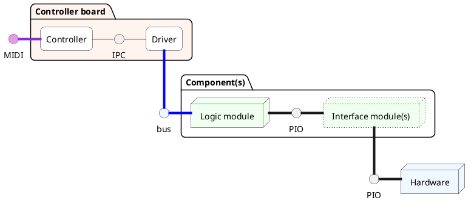
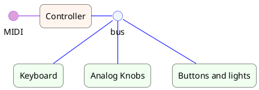
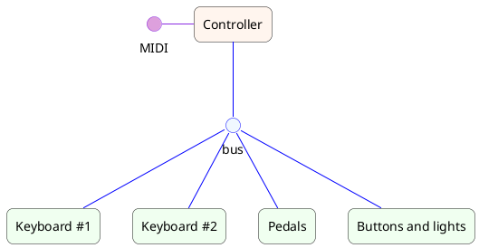

# Lunatic Midi

## Goal

- Modular: configure and combine components and modules to obtain a custom keyboard;
- Efficient: low latency firmwares;
- Simple and cheap: poor man design, with minimal electronic components and easy assembly.

## System diagram

A single controller sends and receives events from a bus to which several components are connected.
Each component, consisting of a logic board and eventually one or more interface boards, communicates with the final hardware.

The final hardware can be mechanical keyboards, pedal boards, buttons and lights, analog controls such as knobs and sliders, etc.

In the controller, the driver coordinates the components using specific communications protocols, while a high-level software take cares of traslating events from-and-to MIDI messages.

## Example: Electronic Keyboard

## Example: Organ

